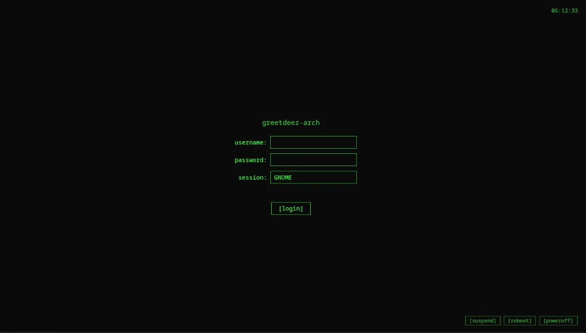

# GreetDeez

Hackable display manager for [greetd](https://git.sr.ht/~kennylevinsen/greetd), powered by Go + webkit2gtk.

[](https://github.com/nickheyer/GreetDeez/actions/workflows/release.yml)
[](LICENSE)
[](https://aur.archlinux.org/packages/greetdeez-bin)



> **This is the default theme.** It serves as an example and template for creating a custom front end for your login UI.

## Themes

GreetDeez ships with three built-in themes: `minimal` (default) and `cyber` - HTML themes rendered in the webview - and [`metal`](#the-metal-theme), a software-rendered demoscene greeter that draws straight to the framebuffer with no webview, no compositor, and no toolkit. Set the theme in `/etc/greetd/greetdeez.conf`:

```toml
[ui]
theme = "cyber"   # "minimal" (default), "cyber", or "metal"
```

To use your own custom front end, point `path` to a directory containing an `index.html` (and any JS/CSS it references). When `path` is set, it takes priority over the built-in theme. See [Building a Custom Front End](#building-a-custom-front-end) for details.

```toml
[ui]
path = "/usr/share/greetdeez-themes/my-theme/dist"
```

The `GREETDEEZ_UI_THEME` environment variable can also be used to override the theme.

## Installation

> **If you already have a display manager running** (sddm, gdm, lightdm, or `plasmalogin` on KDE Plasma 6), the package install will not disable it for you. After installing, disable the existing one and enable greetd:
>
> ```sh
> sudo systemctl disable --now plasmalogin.service   # or sddm / gdm / lightdm
> sudo systemctl enable greetd.service
> ```

### Arch Linux (AUR)

```sh
yay -S greetdeez-bin
```

### Debian / Ubuntu

```sh
curl -1sLf 'https://dl.cloudsmith.io/public/nickheyer/greetdeez/setup.deb.sh' | sudo bash
sudo apt install greetdeez
```

### Fedora / RHEL

```sh
curl -1sLf 'https://dl.cloudsmith.io/public/nickheyer/greetdeez/setup.rpm.sh' | sudo bash
sudo dnf install greetdeez
```

### Alpine

```sh
curl -1sLf 'https://dl.cloudsmith.io/public/nickheyer/greetdeez/setup.alpine.sh' | sudo bash
sudo apk add greetdeez
```

### NixOS (Flake)

Add the flake input and enable the module:

```nix
# flake.nix
inputs.greetdeez.url = "github:nickheyer/GreetDeez";

# configuration.nix
{ inputs, ... }:
{
  imports = [ inputs.greetdeez.nixosModules.default ];

  services.greetdeez.enable = true;
}
```

Optional settings can be passed through as toml:

```nix
services.greetdeez.settings = {
  ui.theme = "cyber";
  power.enabled = true;
};
```

### From source

Requires: Go 1.26+, Node.js 20+, Docker, `libwebkit2gtk-4.1-dev`, `pkg-config`

Runtime dependencies: `greetd`, `cage`, `webkit2gtk-4.1`

```sh
make build
sudo make install
```

After installing from source, create the system user and configure greetd manually:

```sh
sudo useradd -r -s /usr/bin/nologin -d /var/lib/greetdeez -m greetdeez
sudo cp /etc/greetd/greetd.toml /etc/greetd/config.toml
```

Package installs handle both of these automatically.

## Configuration

### greetd

GreetDeez runs inside [cage](https://github.com/cage-compositor/cage) (a single-window Wayland compositor). The greetd config at `/etc/greetd/config.toml` should look like:

```toml
[terminal]
vt = 7

[default_session]
command = "cage -s -- /usr/bin/greetdeez"
user = "greetdeez"
```

This is installed automatically by the packages.

### greetdeez.conf

All options with their defaults (`/etc/greetd/greetdeez.conf`):

```toml
debug = false

[window]
title = "GreetDeez"
# width and height are auto-detected from DRM. Under cage these are irrelevant.
# width  = 1920
# height = 1080
# Wayland output scale, applied via wlr-output-management before the UI starts.
scale = 1.5

[auth]
timeout_seconds = 30

[power]
enabled = true
# poweroff and reboot use POSIX shutdown(8). Only suspend is auto-detected.
# poweroff_cmd = ["shutdown", "-h", "now"]
# reboot_cmd   = ["shutdown", "-r", "now"]
# suspend_cmd  = ["systemctl", "suspend"]

[sessions]
# dirs = [
#     { path = "/usr/share/wayland-sessions", type = "wayland" },
#     { path = "/usr/share/xsessions", type = "x11" },
# ]
# x11_wrapper = ["startx", "/usr/bin/env"]

[ui]
theme = "minimal"
# path = "/path/to/your/custom/ui"
```

Environment variables (`GREETDEEZ_*`) override file values. For example: `GREETDEEZ_UI_THEME`, `GREETDEEZ_UI_PATH`, `GREETDEEZ_WINDOW_TITLE`, `GREETDEEZ_SCALE`, `GREETDEEZ_AUTH_TIMEOUT_SECONDS`, `GREETDEEZ_POWER_ENABLED`, `GREETDEEZ_DEBUG`.

## The Metal Theme

You can speak the greetdeez protocol from anywhere, it doesn't have to be rendered in a webview.

`metal` is a login screen rendered on bare metal. When it's active, greetdeez skips the entire graphics stack - no webkit2gtk, no cage, no Wayland, no GTK. The renderer talks to the backend over the same RPC socket any external front end can use (see [Speaking the protocol without a webview](#speaking-the-protocol-without-a-webview)).

### Enabling it

1. Set the theme in `/etc/greetd/greetdeez.conf`:

   ```toml
   [ui]
   theme = "metal"
   ```

2. Remove cage from the greetd command in `/etc/greetd/config.toml` - metal needs the display to itself:

   ```toml
   [default_session]
   command = "/usr/bin/greetdeez"
   user = "greetdeez"
   ```

## Building a Custom Front End

GreetDeez loads your UI in a webview and injects a global RPC function (`window.__greetdeez_rpc__`) that your code uses to talk to the backend. The [`@nickheyer/greetdeez`](https://www.npmjs.com/package/@nickheyer/greetdeez) npm package wraps this into a typed client so you don't need to deal with the transport layer yourself.

### Install

```sh
npm install @nickheyer/greetdeez
```

### Create the client

```ts
import { createGreeterServiceClient } from "@nickheyer/greetdeez";

const client = createGreeterServiceClient();
```

When running inside GreetDeez, the client uses the injected RPC bridge automatically. During local development (outside the webview), it falls back to no-op defaults - or you can pass mock implementations:

```ts
const client = createGreeterServiceClient({
  dev: {
    listSessions: async () => ({
      sessions: [{ name: "sway", cmd: ["sway"], type: 1, desktop: "" }],
    }),
    getSystemInfo: async () => ({ info: { hostname: "dev" } }),
  },
});
```

### Available methods

| Method | Description |
|---|---|
| `listSessions()` | Get available desktop sessions (Wayland/X11) |
| `getSystemInfo()` | Get hostname |
| `getPowerCapabilities()` | Check which power actions are available |
| `getState()` | Load persisted state (last user, last session) |
| `authenticate({ username, password })` | Validate credentials without starting a session |
| `startSession({ session })` | Start the selected desktop session |
| `login({ username, password, session })` | Authenticate + start session + save state in one call |
| `beginAuth({ username })` | Start an interactive PAM conversation (MFA-capable) |
| `respondAuth({ response })` | Answer the current PAM prompt |
| `cancelAuth()` | Abort the PAM conversation |
| `executePowerAction({ action })` | Poweroff, reboot, or suspend |
| `saveState({ state })` | Persist last user / last session |

### Minimal example

```ts
import {
  createGreeterServiceClient,
  PowerAction,
  type Session,
} from "@nickheyer/greetdeez";

const client = createGreeterServiceClient();

// Load initial data
const { sessions } = await client.listSessions();
const { info } = await client.getSystemInfo();
const { capabilities } = await client.getPowerCapabilities();
const { state } = await client.getState();

// Log in
const session: Session = sessions[0];
const auth = await client.authenticate({ username: "nick", password: "..." });
if (auth.success) {
  await client.startSession({ session });
  await client.saveState({ state: { lastUser: "nick", lastSession: session.name } });
}

// Power actions
await client.executePowerAction({ action: PowerAction.REBOOT });
```

### Interactive auth (MFA / custom)

For PAM stacks that ask for more than a password

```ts
import { PromptType } from "@nickheyer/greetdeez";

let step = await client.beginAuth({ username: "nick" });
while (!step.success && !step.error) {
  // step.prompt.type is SECRET or VISIBLE
  // step.prompt.message is the PAM text
  const answer = await askUser(step.prompt);
  step = await client.respondAuth({ response: answer });
}
if (step.success) {
  await client.startSession({ session });
}
```

Build your project so it outputs an `index.html`, then point GreetDeez at it:

```toml
[ui]
path = "/path/to/your/build/output"
```

## Speaking the Protocol Without a Webview

The webview bridge is just one transport. When the metal theme runs, greetdeez serves the same protobuf protocol on a unix socket (`$XDG_RUNTIME_DIR/greetdeez.sock`, override with `GREETDEEZ_RPC_SOCK`), and the metal renderer is an ordinary client of it - so anything that can open a socket can be a greeter front end, in any language.

Wire format, both directions: `u32` little-endian frame length, then that many bytes of binary protobuf. Requests are `transport.v1.RpcEnvelope` (`method` like `"greetdeez.v1.GreeterService/Login"`, `payload` = encoded request message), responses are `transport.v1.RpcResult`. One request per connection is in flight at a time. Schemas live in `proto/**/*.proto`; `pkg/rpc.SocketClient` and `ui/metal/client.go` are the reference Go client.


Any framework (or none) works - the only requirement* is that your output is a static site that imports `@nickheyer/greetdeez`. This is of course just a client wrapper around the greetdeez protocol, which you could implement yourself, see: `proto/**/*.proto`


## License

[MIT](LICENSE)
